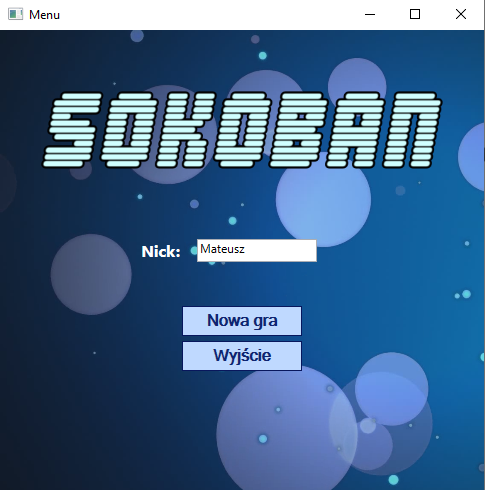
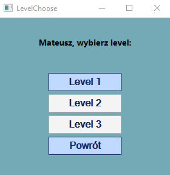
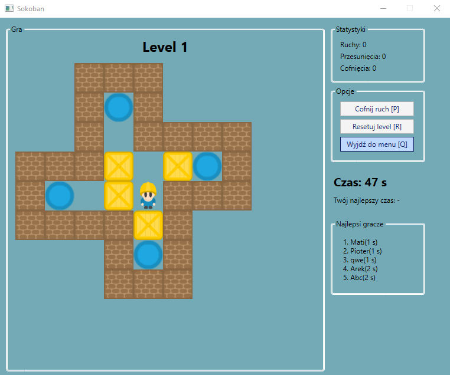
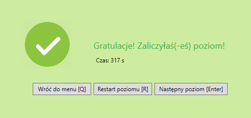

# Sokoban Game
<br/><br/>
This is a simple logic game in which the player pushes crates or boxes around in a warehouse, trying to get them to storage locations.

## Technologies
* Windows Presentation Foundation (WPF)
* Json.NET - NewtonSoft (MIT license)

## Features
* Level Selection
* Unlocking levels
* Counting level time
* Game statistics
* Top 5 players in each level 
* Special keyboard shortcuts which make the GUI easier

## Screenshots





## Setup
* Clone this repo to your desktop
```
git clone https://github.com/m-uszynski/sokoban.git
```
* Go to `./bin/Debug` location
* Run SokobanGraph.exe
